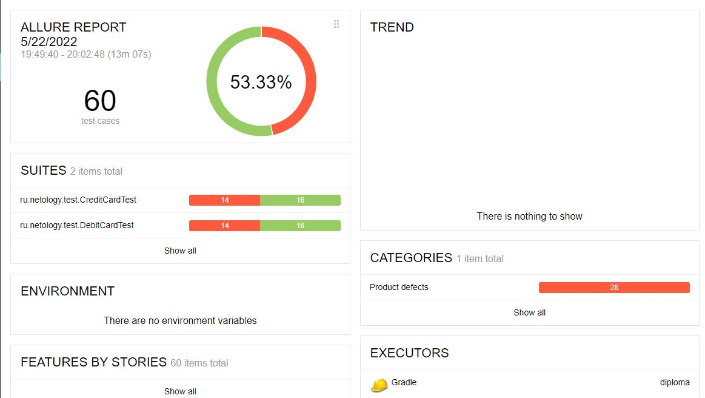
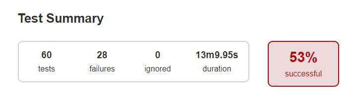

# Отчет о тестировании
## Описание:
* Проведено автоматизированное тестирование покупки тура в Марракеш.
* Проверена поддержка заявленных СУБД: MySQL и PostgreSQL. Приложение работает с заявленными СУБД

### Количество тест-кейсов
* 30 тест-кейсов для обычной покупки тура
* 30 тест-кейсов для покупки тура в кредит

### Скриншоты

### Рекомендации
Текущая версия тестируемого приложения не готова к релизу из-за большого количества  [багов](https://github.com/KateDenis/qa-diploma/issues)
